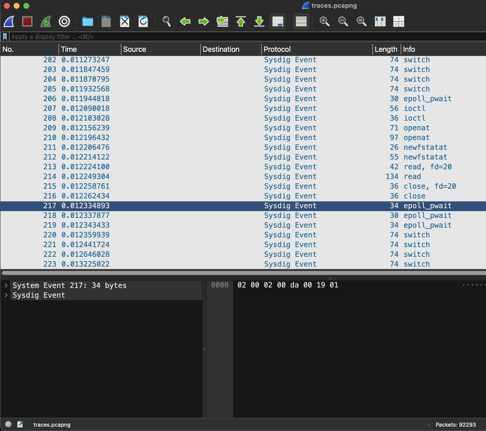

# Stratoshark - CSCG CTF 2025
- Challenge Name: __Stratoshark__
- Challenge category: __forensics__
- Challenge Difficulty: __easy__
- Challenge points: __138__
- Challenge Author: __dontrash__
- CTF Year and Date: __2025-03-01 - 2025-05-01__
- Author: __nebuc42__
- Date: __2025-05-12__

## Challenge Description
We have noticed some strange behaviour on our development server. Maybe this new tool from those Wireshark guys can help. Can you find out what is going on with our server?

Flagformat: `dach2025{....}`

# Information Gathering
I first opened the file with wireshark and was very confused. While browsing, I could not imagine, that the <spärliche> information presented could lead to any flag. I ended up googling for “SysDig” [1]() and eventually found the “stratoshark”-tool (2)

 
After installing and opening the provided pcapng – File with stratoshark there was much more information available. However, I was quickly overwhelmed with the amount of information available and had no idea of where to start after looking at the entries for a few minutes.
 
## Rabbit-Hole (1)
I hoped, some more googling will help and ended up analyzing the pcapng file using the sysdig-tool
<!-- user -->
<!-- examples of sysdig commands and -->
 
## Getting an Overview
While the sysdig excursion did not yield any quick results, I turned back to stratoshark. Filtering did not yet make sense to me, because, I did not know, what to look for. Because stratoshark is a wireshark sibling, it also offers some statistic analysis of the file. The statistics of the current pcap yielded some interesting information
 
<screenshot of process-statistics>
 
## Weitere statistiken?
 
## System
It seems to be a Linux system because x,y processes are present
 
## Process
I decided to have a quick look at some processes applying the display filters in stratoshark
- Node `proc.name == node` The node process seems to run the vs code development process. This makes sense, as the challenge description yields that this is in fact the ‘development server’
- Ssh `proc.name== ssh`: There were sessions from different src addresses (). Because there is no data nor user information available in the pcap, I quickly abandoned this path. Possibly the users are connecting to the server using ssh and are tunneling the communication with the development server through ssh.
- top `proc.name ==  top`. A this time of the analysis, it the presence of the top process made no sense to me. I assume, that one of the users logged in one of the ssh-sessions was monitoring the server, because they had <festgestellt> some unusual behaviour
 
## sharky process
The sharky process attracted my interest. A google search gave the impression that this is not a well known process. Let's look at it by filtering for this process `proc.name == sharky`
 
<screenshot sharky startup>
<screenshot connect and key>
<screenshot tmp file written>
<screenshot flag written>
<screenshot heartbeat>
 
Whois of he c2 IP address à XEROX
 
## Rabit Hole (2)
Filtering too much: Only looking at a single process was a dead end, ause the connections and interplay are lost. Looking at the actions of the sharky process alone does only is only one part of what's goin on.
 
## Active debugging session
After giving up digging further into this rabbit hole, I decided to ditch the display filter (proc.name == sharky) o be able to look at the arguments just before the sharky process has been started. It took me some time & scrolling before I suddenly realized a debugging session has been started by the sharky process
 
<screenshot PTRACE_ATTACH>
 
Decode the data injected into the process-memory of the top-process
<screenshot PTRACE_POKE>
 
<screenshot raw address/Bytes>
<decode script>
<decoded string>
 
## IO/operations
Now it seemed like a good idea, to do a deep investigation of the top process after its memory has been tampered with
`proc.name == top` 
 
## summary of reconnaissance
- Aus dem vorliegenden pcap können wir folgendes herauslesen
- sysdig is running on a linux system being used as a vs code service
- mehrere ssh sessions zu verschiedenen IP addressen (möglicherweise ssh-tunnels)
- ungewöhnlich ist ein laufender top-prozess
- A suspiciuous `sharky` process, which is started in the second third (@ timestamp/id). After starting, it obviously connects to a c2 server, where it retrieves an encryption key and reports the success of its mission (flag written) to the server, before going into a passive mode in which it regularly (every x seconds) sends a hardbeat.
- The memory of the top process has been altered by a debugging session started from within the sharky process (PTRACE_POKE) after the sharky process writes 40 bytes to a file in the tmp directory `/tmp/`
After the debugging session has been closed, the top process reads a library file and then writes an
 
# Solution
 
 
# Conclusion
- Consider the hints of the challenge authors: “stratoshark” and the “wireshark guys”
- When presented with a caputer file (netcap, sysdig) It might be good idea to look at the statistics first
- Filtering the write action quickly yields interesting insights of io operations (files, networks) and possible connections between the monitored processes.
 
# References

1. [SysDig](https://sysdig.com/)
2. What is [Stratoshark](https://sysdig.com/learn-cloud-native/?what-is-stratoshark/)
3. [Fishing for Hackers](https://sysdig.com/blog/fishing-for-hackers/)
4. Sysdig chisel
3. Library injection
4. Debuging-operations
5. XOR